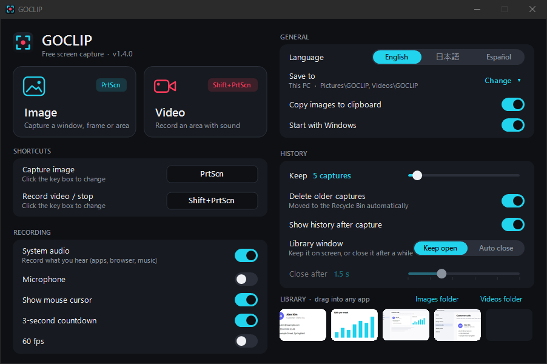
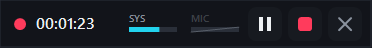

<h1 align="center">GOCLIP</h1>

<b>Free screen capture for Windows — images and video with sound.</b> 
Hover to find the frame. Click to capture.

<a href="https://github.com/aimusicdev/GOCLIP/releases/latest"><b>⬇ Download the latest version</b></a>

---

## What it does

- **Smart frame detection** — move the mouse and GOCLIP highlights the window, pane, toolbar, button or web‑page block under the cursor. The highlight follows every move. Scroll the wheel for a wider or finer frame.
- **Images** — PNG, saved and copied to the clipboard in one click.
- **Video with sound** — MP4 (H.264 + AAC). Record system audio, your microphone, or both. Pause, resume, stop or discard; the red frame and toolbar never show up in the video.
- **Mosaic** — hide any number of areas in images and videos. In videos, set a start and end for each area, and let it follow moving content.
- **Save anywhere** — This PC, Google Drive, OneDrive, Dropbox, iCloud Drive, Box, a NAS or any folder.
- **Share** — Windows share, email, Gmail, Outlook.com, X, Facebook, LinkedIn, Threads, Bluesky.
- **Preview your way** — keep the preview open, or let it fade out after 0–5 seconds.
- **Your shortcuts** — PrtScn by default; set any key combination you like.
- **Tiny and portable** — a single ~0.6 MB `.exe`. No installer, no account, no ads, no watermark.

## Get started

1. Download `GOCLIP-x.y.z-win64.zip` from [Releases](https://github.com/aimusicdev/GOCLIP/releases/latest) and unzip it.
2. Run `GOCLIP.exe`. It lives in the system tray.
3. Press a shortcut:

| Action | Shortcut |
|---|---|
| Capture image | `PrtScn` |
| Record video (press again to stop) | `Shift+PrtScn` |

Change either shortcut under **SHORTCUTS** in the GOCLIP window — click the key box and press the new keys. If another app also uses PrtScn, GOCLIP takes priority while it runs.

While selecting: **click** a frame · **drag** your own area · **wheel** wider / finer · **Space** whole monitor · **arrow keys** move 1 px · **Esc** cancel.

## Requirements

Windows 10 (version 2004 or later) or Windows 11, 64‑bit. Uses the H.264/AAC encoders built into Windows; nothing else to install.

> **"Windows protected your PC"?** New apps show this until they build a reputation. Click **More info → Run anyway**.

## Privacy

GOCLIP runs entirely on your PC. It sends nothing anywhere unless you choose to share.

## License

Free to use and share. © 2026 Gocoo Inc. Third‑party notices are included in the download.
